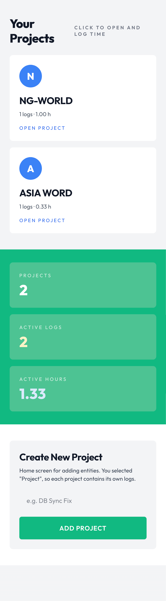

# Keep Track

Keep Track is a Nuxt 3 PWA time-tracking app that stores data in localStorage.

## Screenshot



## Features

- Add and manage projects.
- Log work in 20-minute increments.
- Mark payment done with `Select All` or custom hours.
- Export project logs to PDF.
- Delete projects only after logs are cleared.
- Installable PWA with offline support.

## Tech Stack

- Nuxt 3
- Vue 3
- Tailwind CSS v4
- @vite-pwa/nuxt
- jsPDF

## Setup

```bash
npm install
```

## Development

```bash
npm run dev
```

## Type Check

```bash
npm run typecheck
```

## Build

```bash
npm run build
```

## Static Generate

```bash
npm run generate
```

## Deploy to GitHub Pages

This repository includes a Pages workflow at `.github/workflows/deploy-pages.yml`.

- Push to `main` to trigger deployment.
- Or run it manually from the Actions tab.
